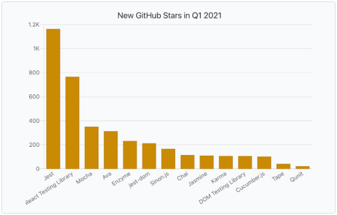

# Use jest on legacy
jquery legacy project 에 unit test framework 중 jest 적용

https://jestjs.io/


Github Starts 기준으로 2021년도 Best JS Test Framework

## Install
```
npm install jest --global
```

## Execute
```
D:\workspace\legacy-unit-test>jest
Error: Could not find a config file based on provided values:
path: "D:\workspace\legacy-unit-test"
```
Complete!

## Mechanism
- js 의 파일에서 하는 일 = 특정 DOM element 를 동적으로 변화 시키는 일
- node 자체가 js 이기 때문에, Browser 와 같은 document 상태라면 테스트 대상 js 를 실행 시켜 볼 수 있다.

## Target
- layout.js

## jest.config.js
```
module.exports = {
    testEnvironment : 'jsdom',
    setupFilesAfterEnv: ['./jest.setup.js'],
};
```

## Goals
- init() 실행
- gridGNB() 정상 동작 확인
- gridSNB() 정상 동작 확인
- this.atGNBMenuID.length > 0 충족하여 $('#gnb_title_' + this.atGNBMenuID) 의 background 가 바뀌는지 여부 확인
- fixResize() 한번 실행 되는가 확인
- $.cookie 한번 실행 되는가 확인

## Explains
- test 환경(node)에서 Target 을 load 해온다.
- Goals 를 하나씩 실행하여 testing

## Check points
- jquery 가 먼저 load 되있어야 정상 실행이 가능함 => jquery 를 먼저 require (https://jestjs.io/docs/configuration#setupfilesafterenv-array)
- js logic의 실행 뿐 아니라 DOM Element 가 변경되는 부분들을 어떻게 체크 할 것인가? => testEnvironment option 을 'node' 에서 'jsdom' 으로 설정 (https://jestjs.io/docs/configuration#testenvironment-string)

## Mock pageDATA
```
global.pageDATA = {
    scriptURL: 'staff_jest.com',
    gnbJSON: JSON.stringify([
        {
            is_use: 1,
            src: 'staff_jest.com',
            menu_id: 'clicked_menu_parent',
            child: [
                {
                    is_use: 1,
                    src: 'staff_jest.com',
                    menu_id: 'clicked_menu_child'
                }
            ],
        }
    ]),
    snbJSON: JSON.stringify([]),
};
```

## Result
```
const layout = require('./layout');
global.pageDATA = require('./mock.pageData');

test('is loaded', () => {
    expect(layout.init).toBeDefined();
    expect(layout.atMenuID).toBeDefined();
});

document.body.innerHTML = `
<div id='gnb'></div>
<div id='snb'></div>
<div id='gnb_title_gnb_parent'></div>
<div id='snb_title_gnb_child'></div>
`;
describe('exec init', () => {
    const fixResize = $.fn.fixResize = jest.fn();
    const cookie = $.cookie = jest.fn();

    layout.init();
    test('atGNBMenuID', () => {
        expect(layout.atGNBMenuID).toEqual('gnb_parent');
    });
    test('atSNBMenuID', () => {
        expect(layout.atSNBMenuID).toEqual('gnb_child');
    });
    test('#gnb ', () => {
        expect(document.getElementById('gnb').innerHTML.length).toEqual(447);
    });
    test('#snb', () => {
        expect(document.getElementById('snb').innerHTML.length).toEqual(168);
    });
    test('called fixResize', () => {
        expect(fixResize.mock.calls.length).toEqual(1);
    });
    test('called cookie', () => {
        expect(cookie.mock.calls.length).toEqual(1);
    });
    test('changed dom', () => {
        expect(document.getElementById('gnb_title_gnb_parent').style.background).toEqual('rgb(93, 177, 241)');
        expect(document.getElementById('snb_title_gnb_child').classList[0]).toEqual('selected');
    });
});
```